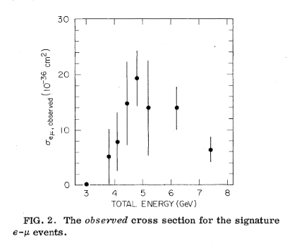
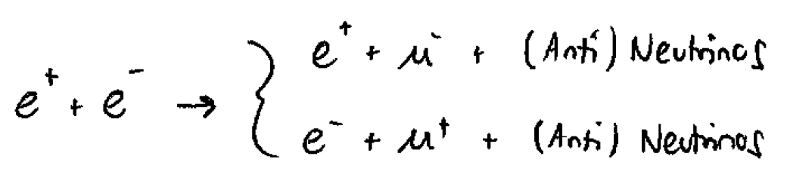

This plot [1] is the first experimental evidence for the particle that would eventually be named the tau. 

On the horizontal axis is the energy of the experiment. This particular experiment collided electron and positron beams. On the vertical axis is the *cross section* of a specific event resulting from the electron and positron beams colliding. The cross section is like a probability for a given event to occur. When two particles collide, many many things can happen, each with their own probability. The *cross section* for an event encodes the probability for that particular event to occur. Events with larger probability have larger cross sections and vice versa. 

The collaboration found one event could not be explained by the Standard Model at the time. The event in question looks like:

This event is peculiar because the final state contains both an electron and a muon with opposite charges. In 1975, when this paper was published, there was no way to obtain this final state, from any known particles or interactions. 

In order to explain this anomaly, particle physicists proposed the following explanations:

1. Pair production of a heavy lepton. With some insight from the future, we will call this heavy lepton the "tau." 

2. Pair production of charged Bosons. These charged bosons actually end up being the $W^\pm$ bosons that mediate the weak nuclear force.

The production of tau's and these bosons are not equally likely though. Depending on the initial energy of the beams, we are more likely to produce one than the other. It turns out that at the energies of this experiment (a few GeV), it is much more likely to produce taus than to produce the bosons. We would say that the taus have a larger *cross section* than the bosons. From the plot, we can read off that the production of taus, their cross section, is largest at around 5 GeV of energy. Finally, since these taus are the result of **pair** production, they are produced in **pairs**. This bump at 5 GeV is the energy at which it is most likely to produce a pair of taus. This plot then predicts the tau to have a mass of about 2.5 GeV. 

----

### References

[1] - [Evidence for Anomalous Lepton Production in e+−e− Annihilation](https://journals.aps.org/prl/abstract/10.1103/PhysRevLett.35.1489)