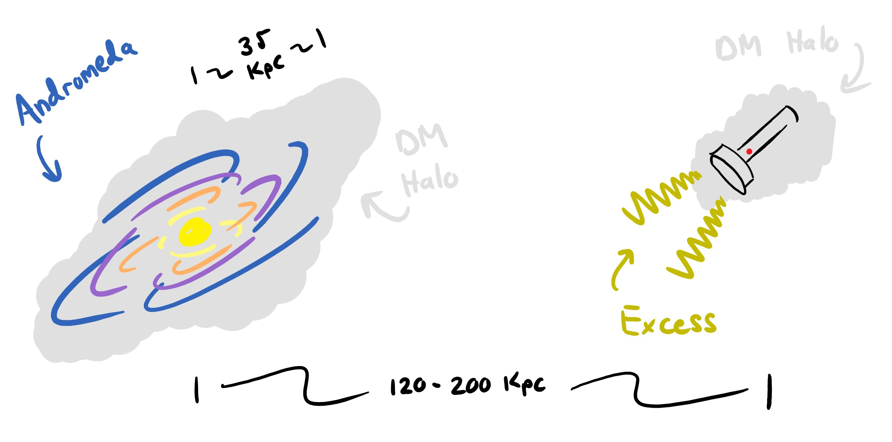
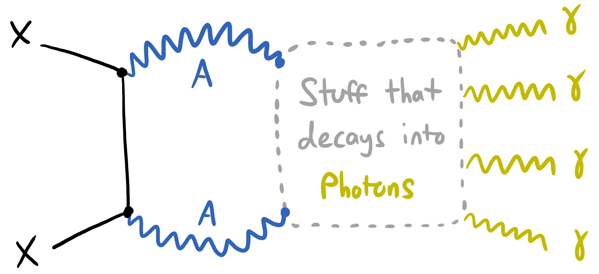

In a recent paper [1], Chris Karwin et al. report an excess in gamma rays that seem to be originating from our nearest galaxy Andromeda. The amount of excess is arguably insignificant, roughly 3% - 5%. However, the spatial location of this excess is what is interesting. The luminous region of Andromeda is roughly 70 Kpc in diameter [2], but the gamma ray excess is located roughly 120 - 200 Kpc from the center. Below is a roughly-to-scale representation of the spatial extent of Andromeda and the excess:

There may be many possible explanations and interpretations for this excess, one of the more exotic possibilities is dark matter annihilations. The dark matter paradigm says that galaxies form within "dark matter halos," a cloud of dark matter that attracts luminous matter that will eventually form a galaxy [3]. The dark matter halo encompassing Andromeda has a virial radius of about 200 Kpc [4], well beyond the location of the gamma ray excess. This means that there is dark matter at the location of the excess, but how do we start with dark matter and end up with photons?

Within the "light mediator" paradigm of dark matter particle physics, dark matter can annihilate with itself into massive dark photons, the dark matter equivalent of the photon. These dark photons by ansatz, interact with the standard model which can ultimately give us photons. A schematic diagram of this process is provided below:

References:

[1] - [FERMI-LAT Observations Of Gamma Ray Emission Towards the Outer Halo of M31](https://arxiv.org/abs/1903.10533v2). This is the paper that reports the gamma ray excess from Andromeda.

[2] - [A kinematically selected, metal-poor stellar halo in the outskirts of M31](https://arxiv.org/abs/astro-ph/0602604). This work estimates the size or extent of Andromeda.

[3] - [The Connection between Galaxies and their Dark Matter Halos](https://arxiv.org/abs/1804.03097). This paper details how dark matter halos relate and impact galaxy formation. 

[4] - [Stellar mass map and dark matter distribution in M31](https://arxiv.org/abs/1208.5712). This paper determines various properties of the Andromeda dark matter halo.
