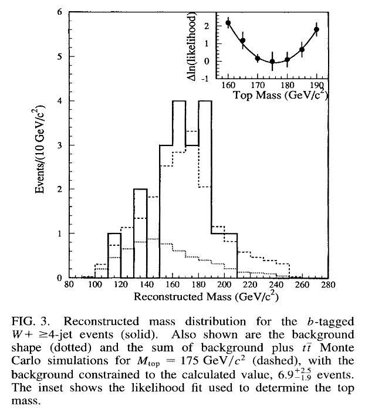

This post is about the discovery of the most massive quark in the Standard Model, the top quark. Below is a “discovery plot” [1] from the Collider Detector at Fermilab collaboration (CDF). [Here is the original paper](https://journals.aps.org/prl/abstract/10.1103/PhysRevLett.74.2626).

This plot confirms the existence of the top quark. Let’s understand how. 

For each proton collision that passes certain selection conditions, the horizontal axis shows the best estimate of the top quark mass. These selection conditions encode the particle "fingerprint" of the top quark. Out of every single proton collision, we only want to look at ones that perhaps came from top quark decays. This subgroup of events can inform us of a best guess at the top mass. This is what is being plotted on the x axis.

On the vertical axis are the number of these events. 

The _dashed_ distribution is the number of these events originating from the top quark **if** the top quark exists **and** decays this way. This could very well not be the case.

The _dotted_ distribution is the background for these events, events that did not come from top quark decays.

The solid distribution is the measured data.

To claim a discovery, the background (dotted) plus the signal (dashed) should equal the measured data (solid). We can run simulations for different top quark masses to give us distributions of the signal until we find one that matches the data. The inset at the top right is showing that a top quark of mass of 175GeV best reproduces the measured data.

Taking a step back from the technicalities, the top quark is special because it is the heaviest of all the fundamental particles. In the Standard Model, particles acquire their mass by interacting with the Higgs. Particles with more mass interact more with the Higgs. The Top mass being so heavy is an indicator that any new physics involving the Higgs may be linked to the Top quark. 

---------

### References

[1] - [Observation of Top Quark Production in pp Collisions with the Collider Detector at Fermilab](https://journals.aps.org/prl/abstract/10.1103/PhysRevLett.74.2626)

